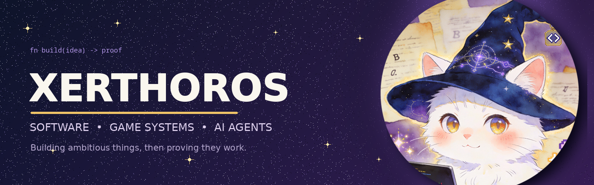

  

  
  
  
  

## Hi, I'm Xerthoros.

I build software products, game systems, and AI-assisted developer tools. I usually get more interested after the prototype starts working. That is when the awkward bugs, migration problems, queue behavior, and deployment failures finally show themselves.

I use AI agents every day because they help me move faster. Generated code still has to earn its place: I need to reproduce the behavior, review the change, and see it work outside the happy path.

> A clean demo is nice. A system that survives bad input and a rough deployment is better.

## What I build

### [CrispLint](https://crisplint.com)

A production BYOK code-review platform for GitHub. It combines deterministic scanning with specialist AI reviewers for security, correctness, missing tests, and unnecessary code. The system runs as a TypeScript monorepo with NestJS, Next.js, PostgreSQL, Redis/BullMQ, GitHub Apps, and Railway.

[Website](https://crisplint.com) · [Dashboard](https://app.crisplint.com) · [Documentation](https://crisplint.com/docs) · [Install GitHub App](https://github.com/apps/crisplint/installations/new)

### Systems modernization

I re-engineer legacy applications instead of wrapping them forever. My current systems work includes moving stateful PHP game logic toward a standalone Rust architecture with parity oracles, transactional boundaries, deterministic migration tests, and performance gates.

### Game systems

I build game systems with Godot, focusing on deterministic rules, reliable save/load behavior, localization, and browser performance. I like authored stories and expressive visuals, but input, state recovery, and testing matter just as much.

### Agent-assisted engineering

I use Hermes Agent and coding agents to research, plan, implement, review, and verify long-running projects. The useful part is not asking an agent to write a lot of code. It is breaking the work into small slices, preserving evidence, and refusing to call a process successful just because it exited cleanly.

## How I work

- Start with a small vertical slice and prove the behavior before expanding it.
- Use RED → GREEN → REFACTOR when a rule can be tested.
- Keep safety boundaries explicit around secrets, money, migrations, and production state.
- Run end-to-end checks against the real deployment path, not only mocks.
- Prefer honest progress reports over impressive-looking completion claims.
- Treat performance, recovery, and operations as product work.

## Toolbox

  
  
  
  
  

  
  
  
  
  

  
  
  
  
  

---

  Build the idea. Test the claim. Keep the evidence.

